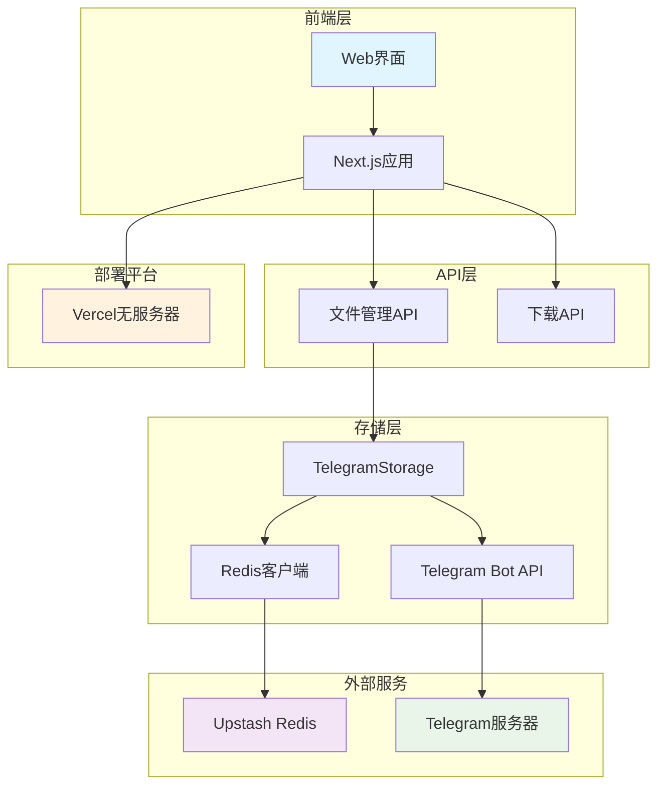
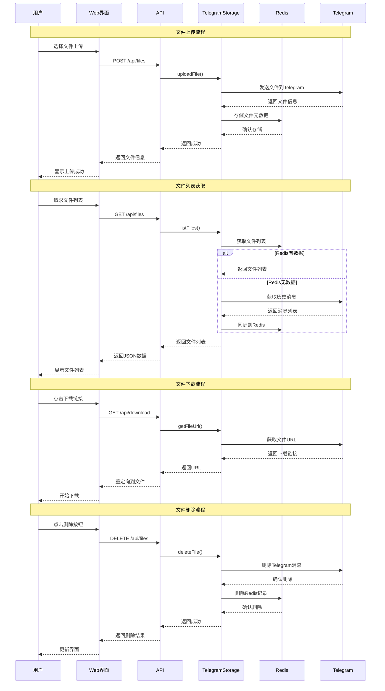

# TgNetBucket

TgNetBucket是一个使用Telegram作为存储后端的文件存储服务，通过Vercel托管前后端页面进行管理。

## 功能特点

- 🚀 使用Telegram Bot API存储文件
- 📁 支持文件上传、下载、列表查看和删除
- 💾 集成Upstash Redis持久化存储
- 🎨 简洁美观的Web界面
- ☁️ 易于部署到Vercel平台
- 🔄 智能降级机制，确保服务稳定性
- 🌍 全球低延迟访问

## 支持的文件类型和大小限制

### 📋 文件类型支持表

| 文件类别 | 支持格式 | 常见用途 | 推荐大小 |
|---------|---------|---------|---------|
| 📄 **文档类型** | PDF, DOC, DOCX, PPT, PPTX, XLS, XLSX, TXT, RTF, ODT, ODS, ODP | 办公文档、报告、演示文稿 | < 20MB |
| 🖼️ **图片类型** | JPG, JPEG, PNG, GIF, BMP, TIFF, SVG, WebP, ICO, RAW | 照片、设计图、图标 | < 10MB |
| 🎵 **音频类型** | MP3, WAV, FLAC, AAC, OGG, M4A, WMA, AIFF | 音乐、播客、录音 | < 30MB |
| 🎬 **视频类型** | MP4, AVI, MKV, MOV, WMV, FLV, WebM, 3GP, M4V | 短视频、动画、录屏 | < 50MB |
| 📦 **压缩文件** | ZIP, RAR, 7Z, TAR, GZ, BZ2, XZ | 文件打包、备份 | < 50MB |
| 💻 **程序文件** | EXE, MSI, DMG, DEB, RPM, APK, IPA | 软件安装包、应用 | < 50MB |
| 📝 **代码文件** | JS, Python, Java, C++, HTML, CSS, JSON, XML | 源代码、配置文件 | < 5MB |
| 🗃️ **数据文件** | CSV, SQL, DB, JSON, XML, YAML | 数据库、配置、日志 | < 25MB |

### 📏 大小限制详情

| 限制类型 | 数值 | 说明 |
|---------|------|------|
| **单文件最大大小** | 50MB | Telegram Bot API 硬性限制 |
| **推荐单文件大小** | < 25MB | 确保上传稳定性和速度 |
| **文件数量限制** | 无限制 | 受 Telegram 聊天存储空间限制 |
| **文件名长度** | < 255 字符 | 支持中文文件名 |
| **并发上传** | 1 个文件 | 避免 API 限制冲突 |

### ⚠️ 使用建议

#### ✅ **推荐存储**
- 📄 日常办公文档和表格
- 🖼️ 照片和设计文件
- 🎵 音频文件和播客
- 📦 小型软件包和工具
- 💾 配置文件和备份

#### ❌ **不推荐存储**
- 🎬 大型视频文件（> 50MB）
- 💿 系统镜像文件
- 🎮 大型游戏安装包
- 📊 大型数据库文件
- 🔒 敏感或机密文件

#### 🛡️ **安全提醒**
- 文件存储在 Telegram 服务器，请遵守相关法律法规
- 不建议存储包含个人隐私或商业机密的文件
- 建议对重要文件进行加密后再上传

## 系统架构



## 文件操作流程



## 快速开始

### 前提条件

1. 创建一个Telegram Bot（通过BotFather）
2. 获取Bot Token和Chat ID
3. 注册Vercel账号

### 本地开发

1. 克隆仓库
```bash
git clone https://github.com/yourusername/TgNetBucket.git
cd TgNetBucket
```

2. 安装依赖
```bash
npm install
```

3. 创建`.env.local`文件并添加以下内容（可以参考`.env.local.example`）
```
# Telegram配置（必需）
TELEGRAM_BOT_TOKEN=your_bot_token
TELEGRAM_CHAT_ID=your_chat_id

# Upstash Redis配置（可选，推荐用于生产环境）
UPSTASH_REDIS_REST_URL=your_redis_url
UPSTASH_REDIS_REST_TOKEN=your_redis_token
```

   **获取配置信息：**
   - `TELEGRAM_BOT_TOKEN`: 通过 [@BotFather](https://t.me/BotFather) 创建Bot后获得
   - `TELEGRAM_CHAT_ID`: 可以是个人聊天ID或群组ID，用于存储文件
   - `UPSTASH_REDIS_REST_URL` 和 `UPSTASH_REDIS_REST_TOKEN`: 可选配置，用于持久化存储文件列表。详见 [UPSTASH_SETUP.md](./UPSTASH_SETUP.md)

4. 启动开发服务器
```bash
npm run dev
```

5. 在浏览器中访问 http://localhost:3000

### 部署到Vercel

1. 在Vercel中导入GitHub仓库

2. 在环境变量中添加：
   - `TELEGRAM_BOT_TOKEN`: 你的Telegram Bot Token
   - `TELEGRAM_CHAT_ID`: 你的Telegram Chat ID
   - `UPSTASH_REDIS_REST_URL`: 你的Upstash Redis URL（可选）
   - `UPSTASH_REDIS_REST_TOKEN`: 你的Upstash Redis Token（可选）

3. 部署项目

> 💡 **提示**: 虽然Redis配置是可选的，但强烈建议在生产环境中配置Upstash Redis以获得更好的文件列表持久化体验。

## 技术栈

- **前端框架**: Next.js - React全栈框架
- **运行环境**: Node.js - 后端运行环境
- **文件存储**: Telegram Bot API - 主要存储后端
- **数据持久化**: Upstash Redis - 文件列表缓存和持久化
- **部署平台**: Vercel - 无服务器部署和托管
- **HTTP客户端**: Axios - API请求处理

## 项目结构

```
TgNetBucket/
├── pages/                    # Next.js页面
│   ├── api/                  # API接口
│   │   ├── files.js          # 文件管理API
│   │   └── download.js       # 文件下载API
│   └── index.js              # 主页面
├── src/                      # 源代码
│   ├── telegram_storage.js   # Telegram存储实现
│   └── redis_client.js       # Redis客户端配置
├── tests/                    # 测试文件
│   └── telegram_storage_test.js # 存储功能测试
├── .env.local.example        # 环境变量配置模板
├── .gitignore               # Git忽略文件
├── UPSTASH_SETUP.md         # Upstash Redis配置指南
├── package.json             # 项目依赖
├── package-lock.json        # 依赖锁定文件
├── vercel.json              # Vercel配置
├── LICENSE                  # 开源许可证
└── README.md                # 项目说明
```

## 故障排除

### 文件上传失败 (500错误)

如果遇到文件上传失败的问题，请检查以下几点：

1. **环境变量配置**
   - 确保 `TELEGRAM_BOT_TOKEN` 和 `TELEGRAM_CHAT_ID` 已正确配置
   - 在Vercel部署时，需要在项目设置的Environment Variables中添加这些变量

2. **Bot权限**
   - 确保Bot有权限向指定的聊天发送消息
   - 如果使用群组ID，确保Bot已被添加到群组中

3. **文件大小限制**
   - Telegram Bot API对文件大小有限制（最大50MB）
   - 确保上传的文件不超过此限制

### 常见问题

**Q: 为什么文件列表为空？**
A: 如果未配置Redis，文件列表基于内存存储，应用重启后会丢失。配置Upstash Redis可以解决此问题。如果已配置Redis但仍为空，请检查Redis连接配置是否正确。

**Q: 如何获取Chat ID？**
A: 可以向Bot发送消息，然后访问 `https://api.telegram.org/bot<YOUR_BOT_TOKEN>/getUpdates` 查看消息中的chat id。

**Q: 部署后仍然出现500错误？**
A: 检查Vercel的Function Logs，查看详细的错误信息。通常是环境变量配置问题。

**Q: Redis连接失败怎么办？**
A: 
1. 检查`UPSTASH_REDIS_REST_URL`和`UPSTASH_REDIS_REST_TOKEN`是否正确配置
2. 确认Upstash Redis数据库状态正常
3. 如果Redis不可用，系统会自动降级到内存存储，不影响基本功能

**Q: 如何监控Redis使用情况？**
A: 登录Upstash控制台查看数据库使用统计，包括请求次数、存储大小等信息。

**Q: 文件上传后按钮不显示？**
A: 这通常是文件列表同步问题。配置Redis后，文件信息会持久化存储，确保上传后能正确显示操作按钮。

## 更新日志

### v0.3.0 (最新)
- 💾 **集成Upstash Redis持久化存储**
  - 添加Redis客户端支持，解决文件列表丢失问题
  - 实现智能降级机制，Redis不可用时自动切换到内存存储
  - 文件上传后自动存储元数据到Redis，确保按钮正确显示
- 🔄 **改进文件管理逻辑**
  - 优化`listFiles`方法，优先从Redis获取数据
  - 增强`uploadFile`和`deleteFile`方法，同步操作Redis和Telegram
  - 添加自动同步机制，从Telegram历史消息恢复文件列表
- 📚 **完善文档和配置**
  - 添加详细的Upstash配置指南 (`UPSTASH_SETUP.md`)
  - 更新环境变量配置示例
  - 添加Mermaid架构图和流程图
- 🎨 **用户体验优化**
  - 解决文件上传后按钮不显示的问题
  - 提供全球低延迟访问体验
  - 零维护成本的持久化存储方案

### v0.2.0
- 🐛 修复文件上传500错误问题
- 🔧 将模块系统从CommonJS改为ES6模块语法，提高Next.js兼容性
- 📝 改进错误处理和日志记录，提供更详细的调试信息
- 📄 添加`.env.local.example`环境变量配置模板
- 📚 完善README文档，添加故障排除指南

### v0.1.0
- ✨ 初始版本发布
- 🚀 基本的文件上传、下载、列表和删除功能
- 🎨 简洁的Web界面
- 📦 支持Vercel部署

## 许可证

MIT
