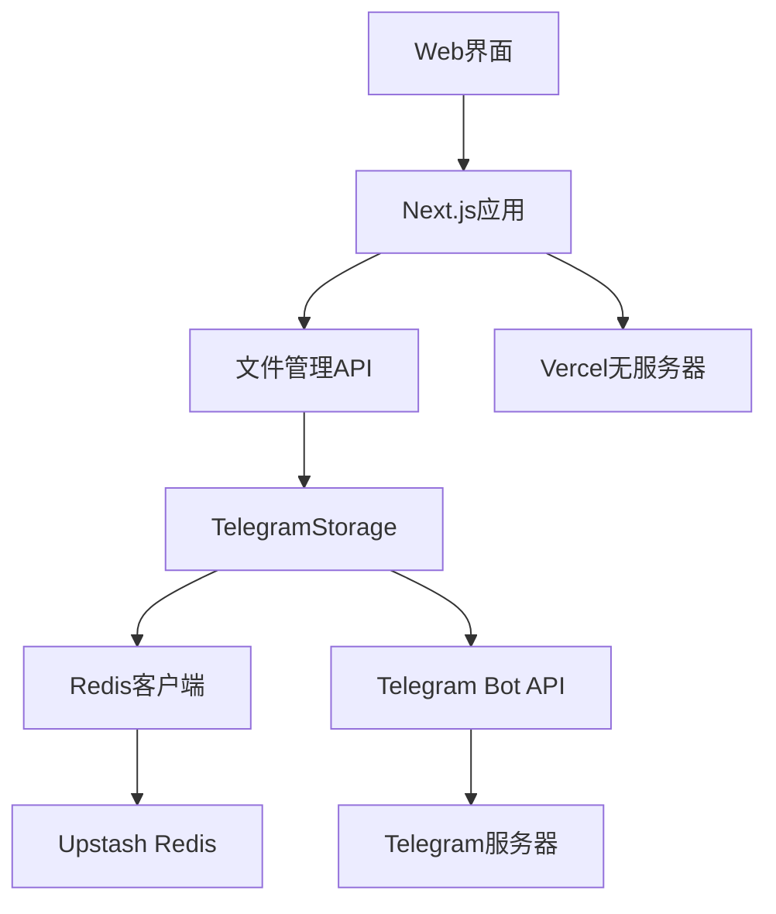

# TgNetBucket

TgNetBucket是一个使用Telegram作为存储后端的文件存储服务，通过Vercel托管前后端页面进行管理。

## ✨ 功能特点

- 🚀 **Telegram存储**: 使用Telegram Bot API作为文件存储后端
- 📁 **完整管理**: 支持文件上传、下载、列表查看和删除
- 💾 **持久化存储**: 集成Upstash Redis，确保数据持久性
- 🎨 **现代化UI**: 渐变背景、毛玻璃效果、响应式设计
- 🖋️ **优雅字体**: LXGW文楷字体集成，完美中英文混排
- ☁️ **一键部署**: 支持Vercel平台快速部署
- 🔄 **智能降级**: 确保服务稳定性，Redis不可用时自动切换
- 🌍 **全球访问**: 低延迟的全球访问体验

## 🖼️ 界面预览

### 主要特色
- **现代化设计**: 紫色渐变背景（#667eea → #764ba2），毛玻璃效果卡片
- **拖拽上传**: 支持直接拖拽文件到上传区域
- **流畅动画**: 淡入、滑动和缩放动画效果
- **响应式布局**: 完美适配桌面、平板和手机设备
- **管理面板**: 侧边栏导航，数据可视化，实时监控

## 📋 支持的文件类型

| 文件类别 | 支持格式 | 推荐大小 |
|---------|---------|---------|
| 📄 **文档** | PDF, DOC, DOCX, PPT, PPTX, XLS, XLSX, TXT | < 20MB |
| 🖼️ **图片** | JPG, PNG, GIF, BMP, SVG, WebP, ICO | < 10MB |
| 🎵 **音频** | MP3, WAV, FLAC, AAC, OGG, M4A | < 30MB |
| 🎬 **视频** | MP4, AVI, MKV, MOV, WMV, FLV | < 50MB |
| 📦 **压缩** | ZIP, RAR, 7Z, TAR, GZ, BZ2 | < 50MB |
| 💻 **程序** | EXE, MSI, APK, DEB, RPM | < 50MB |

**限制说明**:
- 单文件最大: 50MB（Telegram API限制）
- 推荐大小: < 25MB（确保稳定性）
- 文件数量: 无限制

## 🚀 快速开始

### 前提条件
1. 创建Telegram Bot（通过[@BotFather](https://t.me/BotFather)）
2. 获取Bot Token和Chat ID
3. 注册Vercel账号

### 本地开发

```bash
# 1. 克隆仓库
git clone https://github.com/yourusername/TgNetBucket.git
cd TgNetBucket

# 2. 安装依赖
npm install

# 3. 配置环境变量
cp .env.local.example .env.local
# 编辑 .env.local 文件，添加你的配置

# 4. 启动开发服务器
npm run dev
```

### 环境变量配置

在`.env.local`文件中添加以下配置：

```env
# Telegram配置（必需）
TELEGRAM_BOT_TOKEN=your_bot_token
TELEGRAM_CHAT_ID=your_chat_id

# Upstash Redis配置（可选，推荐）
UPSTASH_REDIS_REST_URL=your_redis_url
UPSTASH_REDIS_REST_TOKEN=your_redis_token
```

### 部署到Vercel

1. 在Vercel中导入GitHub仓库
2. 在环境变量中添加上述配置
3. 一键部署

> 💡 **提示**: 虽然Redis配置是可选的，但强烈建议在生产环境中配置以获得更好的持久化体验。

## 🏗️ 系统架构



## 🛠️ 技术栈

- **前端**: Next.js + 现代化CSS3
- **字体**: LXGW文楷字体系统
- **存储**: Telegram Bot API + Upstash Redis
- **部署**: Vercel无服务器平台
- **运行环境**: Node.js

## 📁 项目结构

```
TgNetBucket/
├── pages/                    # Next.js页面和API
├── components/               # 公共组件库
├── hooks/                    # 自定义Hook
├── public/                   # 静态资源
│   ├── fonts/               # LXGW文楷字体
│   └── styles/              # 模块化样式系统
├── src/                     # 核心源代码
├── utils/                   # 工具函数
├── constants/               # 配置常量
└── tests/                   # 测试文件
```

## 📚 文档导航

### 核心文档
- **[Q&A.md](./MD/Q&A.md)** - 常见问题与故障排除
- **[UpdateLog.md](./MD/UpdateLog.md)** - 完整版本更新日志
- **[UPSTASH_SETUP.md](./MD/UPSTASH_SETUP.md)** - Redis配置详细指南

### 开发文档
- **[ARCHITECTURE.md](./MD/ARCHITECTURE.md)** - 项目架构详细说明
- **[COMPONENTS_GUIDE.md](./MD/COMPONENTS_GUIDE.md)** - 组件开发指南
- **[HOOKS_GUIDE.md](./MD/HOOKS_GUIDE.md)** - Hook使用指南
- **[REFACTOR_PLAN.md](./MD/REFACTOR_PLAN.md)** - 重构计划

## 📈 当前版本

### v0.6.0 - LXGW文楷字体系统集成 (2025-9-27)

**🖋️ 主要更新**
- 集成LXGW文楷字体，提供优雅的中文显示效果
- 完整的字体系统配置，支持中英文混排
- 性能优化的字体加载策略

**🎨 界面优化**
- 全站字体统一替换
- 字体演示区域展示
- 统一的字体变量系统

> 📖 查看完整更新历史：[UpdateLog.md](./MD/UpdateLog.md)

## ❓ 需要帮助？

- 🔧 **遇到问题**: 查看 [Q&A.md](./MD/Q&A.md) 获取解决方案
- 🐛 **发现Bug**: 在GitHub Issues中提交问题
- 💡 **功能建议**: 参与GitHub Discussions讨论
- 📖 **深入了解**: 阅读项目架构和开发文档

## 📄 许可证

MIT License - 详见 [LICENSE](./LICENSE) 文件
